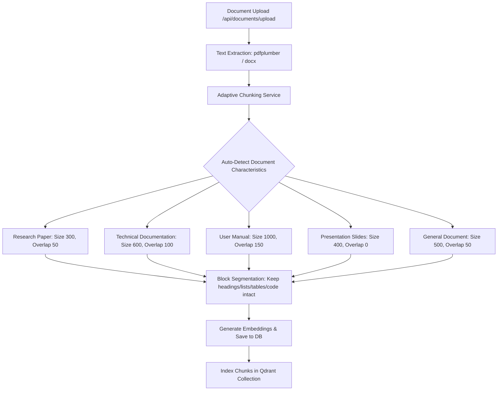
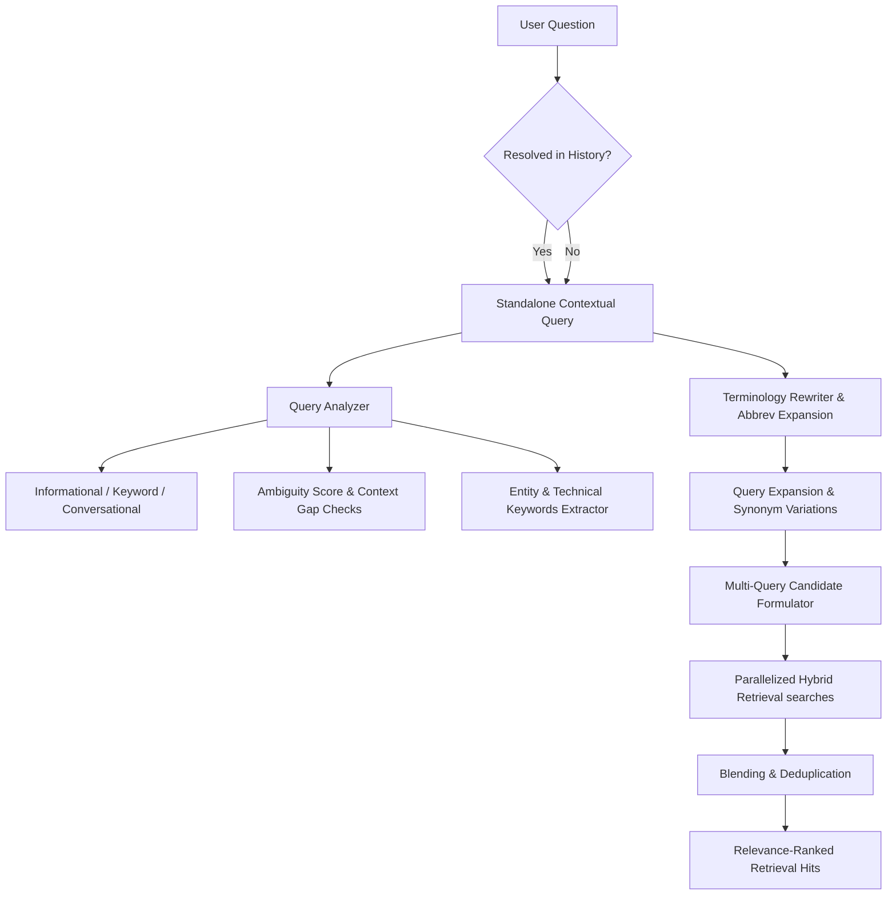
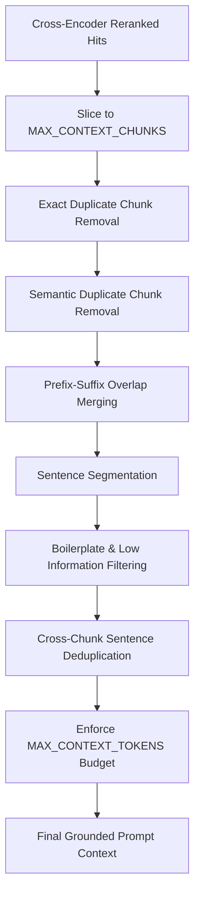
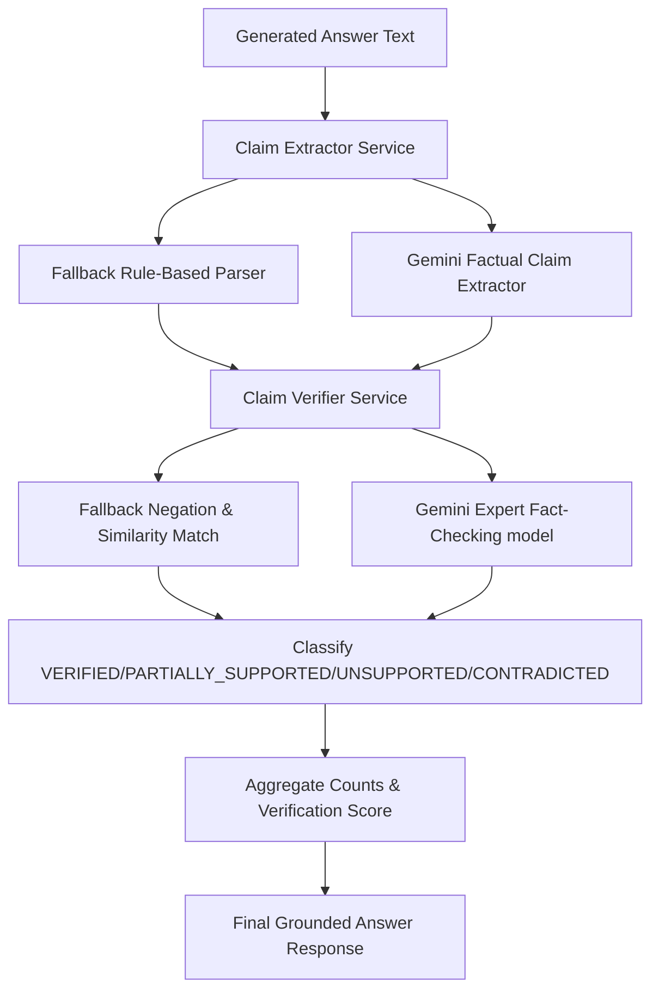
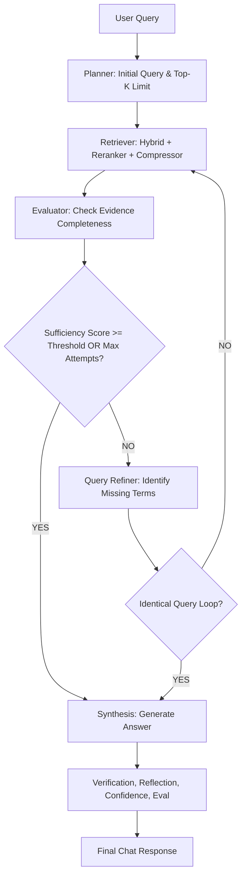
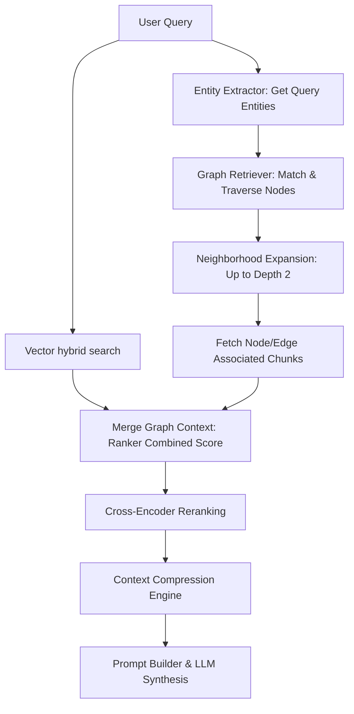

# ContentIQ v2: Query Processing & Adaptive RAG Pipeline Architecture

This document describes the design and integration of the **Query Analysis Framework**, **Query Rewriting Engine**, **Adaptive Retrieval Engine**, **Retrieval Verification Engine**, **Cross-Encoder Reranking Engine**, **Adaptive Chunking Engine**, **Hallucination Detection Engine**, and **Hybrid Retrieval Engine** in the ContentIQ v2 backend.

## Overview

### Request Processing Pipeline

The backend processing pipeline sequentially executes analysis, rewriting, limit optimization, hybrid retrieval (dense + sparse), quality verification, cross-encoder scoring/reranking, grounded response generation, and hallucination fact-checking:

```mermaid
graph TD
    A[Client Request: /chat or /search] --> B[Query Analyzer Service]
    B --> C{Gemini API Configured?}
    C -- Yes --> D[Gemini 1.5 Flash structured JSON analysis]
    C -- No --> E[Rule-based Fallback Parser]
    D -. Fallback on Error .-> E
    E --> F[QueryAnalysis Object]
    D --> F
    F --> G[Query Rewriter Service]
    G --> H{Query Rewriter Enabled?}
    H -- Yes --> I[Rewrite Engine: LLM / Rule-based / Hybrid]
    H -- No --> J[Bypass: Keep Original Query]
    I --> K[QueryRewriteResult Object]
    J --> K
    K --> L[Adaptive Retrieval Service]
    L --> M{Adaptive Retrieval Enabled?}
    M -- Yes --> N[Adaptive Engine: LLM / Rules-based / Hybrid]
    M -- No --> O[Bypass: Default Top-K limit]
    N --> P[AdaptiveRetrievalResult Object]
    O --> P
    P --> Q[Hybrid Retrieval Engine: Dense + BM25 Sparse]
    Q --> R[Retrieval Verification Service]
    R --> S{Verification FAIL & Enabled?}
    S -- Yes --> T[Configured Retry Strategy: expand_limit / raw_query]
    T --> U[Hybrid Search Retry]
    U --> V[Second Attempt Verification]
    S -- No --> W[Keep Initial Retrieval Chunks]
    V --> X[RetrievalVerificationResult Object]
    W --> X
    X --> Y[Cross-Encoder Reranking Service]
    Y --> Z{Reranking Enabled?}
    Z -- Yes --> AA[Reranker Engine: LLM / Rules-based / Hybrid]
    Z -- No --> AB[Bypass: Original vector ranking]
    AA --> AC[RerankingResult Object]
    AB --> AC
    AC --> AD[LLM Grounded Answer Generation]
    AD --> AE{Chat Endpoint /chat?}
    AE -- Yes --> AF[Hallucination Detection Service]
    AE -- No --> AG[Bypass: Direct output response]
    AF --> AH[HallucinationDetectionResult Object]
    AG --> AI[Final JSON Response with metadata]
    AH --> AI
```

### Ingestion & Chunking Pipeline

The document ingestion pipeline uses adaptive text segmentation to preserve boundaries before embeddings:

---

## 1. Query Analysis Object (`QueryAnalysis`)

The analysis results are structured into a Pydantic model (`app.schemas.query_analysis.QueryAnalysis`):

| Field Name | Type | Description |
| :--- | :--- | :--- |
| `raw_query` | `str` | The original raw user query string. |
| `intent` | `str` | Classified intent (`factual`, `summarization`, `comparison`, `explanation`, `procedural`, `analytical`, `conversational`, `multi-intent`). |
| `complexity` | `str` | Complexity level (`Simple`, `Medium`, `Complex`). |
| `keywords` | `List[str]` | Extracted search keywords with stop words filtered out. |
| `suggested_filters` | `Optional[Dict[str, Any]]` | Optional filter parameters extracted from the query. |
| `intent_confidence` | `float` | Confidence score for the detected intent (0.0 to 1.0). |
| `complexity_confidence` | `float` | Confidence score for the detected complexity (0.0 to 1.0). |
| `reasoning` | `Optional[str]` | Detailed explanation justifying why a query received a particular classification. |

---

## 2. Query Rewriting Object (`QueryRewriteResult`)

The query rewriter reformulates raw queries to optimize document retrieval:

| Field Name | Type | Description |
| :--- | :--- | :--- |
| `original_query` | `str` | The original raw query string. |
| `rewritten_query` | `str` | The reformulated retrieval query. |
| `rewrite_reason` | `str` | Reason/justification for the rewrite transformation. |
| `rewrite_applied` | `bool` | Flag indicating if a rewrite took place (true) or was bypassed (false). |
| `rewrite_confidence` | `float` | Confidence score of the rewrite quality (0.0 to 1.0). |

---

## 3. Adaptive Retrieval Object (`AdaptiveRetrievalResult`)

The adaptive retrieval engine dynamically selects retrieval search sizes (limit parameters) and strategy routes:

| Field Name | Type | Description |
| :--- | :--- | :--- |
| `retrieval_strategy` | `str` | The selected retrieval strategy router. |
| `selected_top_k` | `int` | The dynamic retrieval limit size (Top-K) parameter. |
| `retrieval_reason` | `str` | Justification explaining why this strategy/top-k was chosen. |
| `confidence` | `float` | Confidence score of the adaptive routing decision (0.0 to 1.0). |

---

## 4. Retrieval Verification Object (`RetrievalVerificationResult`)

The retrieval verification engine evaluates similarity scores, relevance, and consistency:

| Field Name | Type | Description |
| :--- | :--- | :--- |
| `verification_status` | `str` | Evaluation status: `PASS`, `WARNING`, or `FAIL`. |
| `retrieval_confidence` | `float` | Evaluated confidence score (0.0 to 1.0). |
| `quality_score` | `float` | Calculated retrieval quality score (0.0 to 1.0). |
| `verification_reason` | `str` | Details explaining why a retrieval outcome was chosen. |
| `recommended_action` | `str` | Action: `Continue normally`, `Continue with caution`, or `Trigger retrieval retry`. |
| `first_attempt_status` | `Optional[str]` | Verification status of the first retrieval attempt. |
| `first_attempt_score` | `Optional[float]` | Quality score of the first retrieval attempt. |
| `retry_performed` | `bool` | True if a single retry was executed, otherwise False. |
| `final_attempt_status` | `Optional[str]` | Verification status of the second/final retrieval attempt. |
| `final_attempt_score` | `Optional[float]` | Quality score of the second/final retrieval attempt. |

---

## 5. Cross-Encoder Reranking Object (`RerankingResult`)

The Cross-Encoder reranker evaluates each query-chunk pair using a Hugging Face transformer model, ordering candidates by relevance and pruning chunks below a score threshold:

### Metadata Schema (`RerankingResult`)
- `hits`: List of `RerankedHitMetadata` records detailing original rank index, reranked sorted position index, sigmoid-mapped score, retained/discarded status, and the chunk's text content.
- `model_name`: Name of the cross-encoder transformer model used (e.g. `cross-encoder/ms-marco-MiniLM-L-2-v2`).
- `retained_count`: Count of chunks kept above threshold.
- `discarded_count`: Count of chunks discarded below threshold.
- `original_ranking`: Original sequence of chunk IDs.
- `reranked_ranking`: Reranked and retained sequence of chunk IDs.
- `reranking_confidence`: Overall confidence value of the reranking decision.
- `reranking_reason`: Text detailing justification.

### Scoring and Pruning Heuristics
1. **Model Loading:** Lazily loads the configured transformer model via `sentence_transformers.CrossEncoder`.
2. **Relevance Scoring:** Computes cross-encoder logits for all candidate query-chunk pairs:
   $$logits = model.predict([query, chunk\_text])$$
3. **Sigmoid Normalization:** Converts unbounded raw model logits into probability scores in the `[0.0, 1.0]` range:
   $$score = \frac{1}{1 + e^{-logits}}$$
4. **Filtering and Selection:** Filters out chunks scoring below `RERANK_SCORE_THRESHOLD` (default 0.50). Retained chunks are sorted descending by score and sliced to `RERANK_TOP_K`. Discarded chunks are omitted from the construction context but remain visible in metadata logging.

---

## 6. Adaptive Chunking Engine

The adaptive chunker dynamically determines text segment sizing and overlaps based on auto-detected document characteristics, persisting structural elements without splitting boundaries:

### Document Type Resolution
- **Presentation Slides (`slide_aware` strategy):** Triggered by slides, pptx, or page-break templates. Uses chunk size 400 and overlap 0.
- **Research Paper (`academic_semantic` strategy):** Triggered by academic keywords (abstract, references, DOI, introduction). Uses chunk size 300 and overlap 50.
- **Technical Documentation (`code_and_text` strategy):** Triggered by code fences or SDK/API keywords. Uses chunk size 600 and overlap 100.
- **User Manual (`large_semantic` strategy):** Triggered by guide markers (warranty, troubleshooting). Uses chunk size 1000 and overlap 150.
- **General Document (`default_recursive` strategy):** Fallback for standard files. Uses chunk size 500 and overlap 50.

---

## 7. Hallucination Detection Engine

The hallucination detector validates whether generated answers are factually supported by retrieved evidence context prior to client response dispatch:

### Metadata Schema (`HallucinationDetectionResult`)
- `hallucination_status`: Factuality validation category (`CLEAN`, `WARNING`, or `FAILED`).
- `confidence_score`: Ratio of answer claims verified by evidence.
- `unsupported_claims`: Sentences in generated answers lacking semantic/keyword overlap in source chunks.
- `grounded_claims`: Sentences in generated answers corroborated by source chunks.
- `reasoning`: Detailed justification.

---

## 8. Hybrid Retrieval Engine

The hybrid retrieval engine combines dense semantic search and sparse BM25 keyword search:

### Metadata Schema (`HybridRetrievalResult`)
- `hits`: List of `HybridRetrievalHitMetadata` records detailing source categories (`dense`, `sparse`, or `hybrid`), raw scores, min-max normalized values, and combined scores.
- `original_dense_ranking`: Order of chunk IDs retrieved via embedding similarity.
- `original_sparse_ranking`: Order of chunk IDs retrieved via BM25 keywords matching.
- `merged_ranking`: Sorted sequence of chunk IDs in the final blended candidates list.

### Normalization and Fusion Heuristic
1. **Dense Retrieval:** Retrieves target Top-K chunks using cosine embedding queries from Qdrant.
2. **Sparse Retrieval (BM25):** Tokenizes local SQLite document chunks scoped by target IDs and computes keyword match margins using BM25 Okapi equations.
3. **Score Normalization:** Translates scores `S` into the `[0.0, 1.0]` range using Min-Max scaling:
   $$norm(s) = \frac{s - \min(S)}{\max(S) - \min(S)}$$
4. **Weighted Score Blending:** Computes final blended candidate scores:
   $$final\_score = w_{dense} \cdot norm(s_{dense}) + w_{sparse} \cdot norm(s_{sparse})$$
5. **Deduplication and Slice:** Filters out duplicate chunk IDs and returns the top elements sliced to the dynamically-determined adaptive limit.

---

## 9. Query Transformation Engine

The Query Transformation Engine resides at the entry point of the retrieval pipeline. It preprocesses raw questions before dense vector and BM25 searches occur.

### Architecture Processing Flow

### Key Sub-components

1. **Conversational Context Resolution:** Resolves ambiguous follow-up pronouns (e.g., "how does it work?") by extracting the last 6 messages of history from SQLite, using LLM context rephrasing or fallback keyword mappings.
2. **Query Expansion:** Generates semantic synonyms/variations (e.g., "vector database" -> "embedding database", "Qdrant vector database") to maximize retrieval recall.
3. **Multi-Query Retrieval & Blend:**
   - Evaluates search variations independently.
   - Merges results and sorts by descending relevance score.
   - Deduplicates matches by unique `chunk_id` and slices candidates to the adaptive top-K limit.
4. **Ambiguity Warnings:** Computes ambiguity scores `[0.0, 1.0]`. If `ambiguity_score` exceeds the threshold, it flags `missing_context=True` in metadata.

---

## 10. Context Compression Engine

The Context Compression Engine is positioned after the Cross-Encoder Reranking Engine and before Prompt Construction in the RAG pipeline. It optimizes the retrieved context to fit model constraints, minimize noise, and maximize information density.

### Processing Pipeline Workflow

### Core Compression Operations

1. **Exact & Semantic Duplicate Chunk Removal**: 
   - Detects exact matches of chunk text.
   - Computes cosine similarity of chunk embedding vectors using `embedding_service`. Any chunk exceeding `REDUNDANCY_THRESHOLD` similarity relative to a higher-ranked candidate is pruned.
2. **Overlap Merging**: 
   - Inspects contiguous/overlapping retrieved chunks belonging to the same document and page.
   - Merges them via prefix-suffix matching (minimum 15 overlapping characters) into a single unified context chunk with a score equal to the maximum score of the constituent chunks.
3. **Sentence Deduplication & Filtering**:
   - Segments chunk text into individual sentences.
   - Filters out boilerplate patterns (copyright notices, headers, confidentiality statements, draft watermarks) and low-information sentences below `LOW_INFORMATION_THRESHOLD`.
   - Performs cross-chunk semantic sentence deduplication, ensuring that redundant statements across different chunks are dropped to conserve prompt budget.
4. **Token Budget Enforcer**:
   - Uses character-based token estimation to evaluate current context size.
   - Drops lowest-ranked chunks if the cumulative count exceeds the `MAX_CONTEXT_TOKENS` configuration.

---

## 11. Answer Verification Engine

The Answer Verification Engine executes immediately after answer generation and citation parsing, before returning the final response to the user. It validates every factual claim made in the generated answer against the retrieved evidence context to calculate a verification score and status.

### Processing Pipeline Workflow

### Core Verification Operations

1. **Factual Claim Extraction**:
   - Splits answer text into individual standalone sentences.
   - Ignores conversational greetings, prompts, filler statements, and questions.
   - Preserves original text order and assigns claim IDs (`claim_1`, `claim_2`, etc.).
   - Utilizes structured JSON output from Gemini API when enabled; falls back to rule-based segmentation.
2. **Claim Verification**:
   - Compares each extracted claim against retrieved context chunks.
   - Computes semantic similarity between the claim embedding and chunk sentence embeddings.
   - Detects explicit contradictions via negation word mismatch between the claim and the best-matching evidence sentence.
   - Assigns a classification label:
     - `VERIFIED`: High semantic similarity (similarity $\ge$ VERIFICATION_CONFIDENCE_THRESHOLD).
     - `PARTIALLY_SUPPORTED`: Moderate semantic similarity (0.60 $\le$ similarity $<$ VERIFICATION_CONFIDENCE_THRESHOLD).
     - `UNSUPPORTED`: Low semantic similarity (similarity $<$ 0.60).
     - `CONTRADICTED`: Negation mismatch on high-similarity sentences.
3. **Scoring & Latency Aggregation**:
   - Computes overall verification score:
     $$score = \frac{\text{VerifiedClaims} + 0.5 \cdot \text{PartiallySupportedClaims}}{\text{TotalClaims}}$$
   - Asserts overall verification status `verified = True` if the score is $\ge$ MIN_VERIFICATION_SCORE.

---

## 12. Enterprise RAG Evaluation Framework

The Enterprise RAG Evaluation Framework evaluates overall quality, faithfulness, relevance, precision, recall, and calibration on every generated answer.

### Metrics Computed
1. **Faithfulness**: Fact-grounding overlap checking claim verification status.
2. **Answer Relevancy**: Similarity of generated answer against rewritten queries.
3. **Context Recall / Precision**: Evaluates retrieved chunks matching expected reference documents or gold labels.
4. **Retrieval Recall / Precision**: Evaluates sparse-dense matches relative to ground truth requirements.
5. **Citation Coverage**: Ratio of answer sentences backed by valid inline sources.
6. **Verification Success**: Verification score based on claim-level groundings.
7. **Confidence Calibration**: Correlation between computed pipeline confidence and RAG grade.

---

## 13. Agentic RAG Engine

The Agentic RAG Engine introduces an autonomous reasoning and retrieval loop. Rather than relying on a static query-and-respond pattern, the orchestrator acts iteratively:

### Processing Pipeline Workflow

### Core Operations
1. **Multi-Step Planner**: Resolves the original query and designs the starting search parameter, selecting a dynamic retrieval limit.
2. **Sufficiency Evaluation**: Evaluates cumulative context completeness. If the retrieved texts do not satisfy the planning criteria, it calculates a completeness score.
3. **Query Refinement**: Identifies missing terms (unmatched keywords) and builds an expanded, highly targeted sub-query.
4. **Loop Prevention**: Terminates retrieval loops immediately if a refined sub-query is identical to any previous loop query, preventing infinite cycles.
5. **Unified Synthesis & Evaluation**: Feeds merged, deduplicated context segments to the LLM and processes output through the complete verification, reflection, and scoring pipeline.

---

## 14. Enterprise GraphRAG Engine

The Enterprise GraphRAG Engine augments the standard hybrid vector pipeline with entity-aware and relationship-aware context.

### Processing Pipeline Workflow

### Core Operations
1. **Incremental Knowledge Graph Construction**: During ingestion, text chunks undergo Named Entity Recognition (NER) and Relationship Inference. Extracted items are committed to the persistent JSON-based Graph Store.
2. **Security & Multitenancy Boundaries**: Entities and edges are tagged with their source document IDs. API queries and traversal routes filter graph elements to ensure users only access resources belonging to documents they own.
3. **Neighborhood Expansion / Multi-hop Traversal**: Extracts query nodes, then recursively traverses connected nodes up to `GRAPHRAG_TRAVERSAL_DEPTH`. Edges below `GRAPHRAG_CONFIDENCE_THRESHOLD` are pruned.
4. **Graph Centrality Ranking**: PageRank score is computed iteratively over the traversed subgraph. Chunk relevance is adjusted by combining vector similarity and node PageRank centrality weights:
   $$Score = (1 - w) \cdot Score_{vector} + w \cdot (Score_{base\_graph} + Centrality_{pagerank})$$
5. **Evaluation Coverage**: Evaluates graph retrieval precision/recall, entity/relationship extraction accuracy, and multi-hop success rates for every execution.

